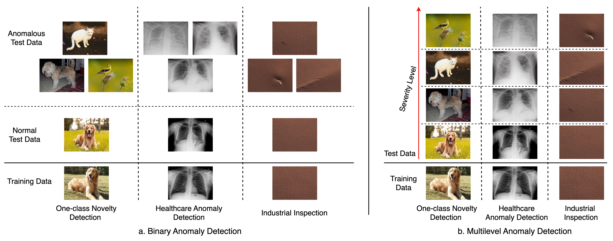

# Are Anomaly Scores Telling the Whole Story? A Benchmark for Multilevel Anomaly Detection



## 0. ⚙️Environment
### 🔧 Step 1: Create a new environment
```bash
conda create -n mmad python=3.9 -y
conda activate mmad 
```

### 📦 Step 2: Install required packages
```bash
pip install -r requirements.txt
```


## 1. 🗂️ Dataset
### Dataset Preview
For a preview of the dataset, please visit the [dataset repo](https://huggingface.co/datasets/tricao1105/MultilevelADSet).

### To download the dataset, just simply run:
```
import os
from datasets import load_dataset

ds = load_dataset("tricao1105/MultilevelADSet")  

output_root = "./MultilevelAD/data"  

for sample in ds:
    image = sample["image"]
    rel_path = sample["relative_path"]
    
    save_path = os.path.join(output_root, rel_path)
    os.makedirs(os.path.dirname(save_path), exist_ok=True)
    image.save(save_path)
```
### Data structure:
After download, the dataset will be stored in the following structure:
```
data/
├── Medical/
│   ├── covid19/
│   ├── diabetic-retinopathy/
│   └── skin-lesion/
│
├── Industry/
│   ├── mvtec/
│   └── visa/
│
├── OneClassNovelty/
│   └── multidog/
│ 
└── template/
```
The `template/` directory contains **39 CSV files**, each corresponding to one subset in the benchmark.

Each CSV file includes the following columns:

- **`image_path_raw`**: Relative path to the image used for inference.
- **`severity`**: Ground-truth severity level of the image.
- **`anomaly_score`**: Initially left blank. This field should be populated with the predicted anomaly scores after running inference.

These CSV files serve as standardized templates for **evaluation** and **performance calculation** across all subsets.

## 2. 🔍 Baselines

Due to differences in model architectures, training strategies, and data organization, we provide multiple baseline implementations under the `baselines/` directory.

Each baseline model has been **adapted and modified** to fit the multilevel AD setting.

### 🚀 How to Run

To run a baseline, please follow the specific instructions provided in each corresponding subfolder under `baselines/`.

After running a baseline model, the output results will be saved in: `./results/{name_of_model}/`. Each result is a CSV file that **follows the same format** as the files in the `template/` directory, but with the **`anomaly_score`** column **fully populated** based on the model predictions.

## 3. 🤖 Multimodal-LLM Multilevel AD (MMAD)

We provide the implementation of **Multimodal-LLM-based anomaly detection (MMAD)** under **few-shot learning** settings in the `MMAD/` folder.

This setup leverages large multimodal models (e.g., GPT-4V, Claude) to perform **multilevel anomaly detection** without requiring full model training.

### 🚀 How to Run

1. Replace the placeholders with your **OpenAI API key** and **Anthropic API key** in the appropriate scripts.
2. Navigate to the `MMAD/` folder.
3. Execute the corresponding script for the target dataset.

For example, to evaluate the `multidog` dataset:

```bash
cd MMAD
python multidog.py
```

## 4. 📈 Performance Calculation

After obtaining the results in the same format as the predefined templates and saving them in the `./results/` directory,  
you can simply run the following script to compute the performance metrics:

```bash
python get_performance.py
```
This script will evaluate the predictions using the following metrics: **ROC-AUC**, **Concordance Index** and **Kendall’s Tau-b**. 

 ## 5. Reference
The paper is available at [arXiv](https://arxiv.org/abs/2411.14515).

Please cite this paper if it helps your research:
```bibtex
@article{cao2024anomaly,
  title={Are Anomaly Scores Telling the Whole Story? A Benchmark for Multilevel Anomaly Detection},
  author={Cao, Tri and Trinh, Minh-Huy and Deng, Ailin and Nguyen, Quoc-Nam and Duong, Khoa and Cheung, Ngai-Man and Hooi, Bryan},
  journal={arXiv preprint arXiv:2411.14515},
  year={2024}
}
```

